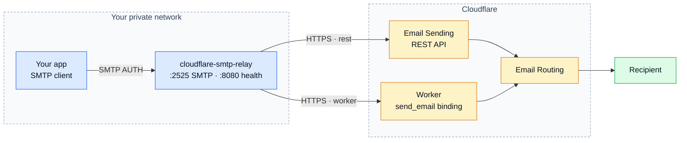

<div align="center">

# cloudflare-smtp-relay

**An SMTP submission server for apps that only speak SMTP, delivering through the Cloudflare Email Service HTTP API.**

[](https://github.com/DanielGS/cloudflare-smtp-relay/actions/workflows/ci.yml)
[](https://github.com/DanielGS/cloudflare-smtp-relay/releases)
[](https://go.dev)
[](#license)
[](https://github.com/DanielGS/cloudflare-smtp-relay/pkgs/container/cloudflare-smtp-relay)
[](#scope)

</div>



> **Send mail from your own domain on Cloudflare's free tier, without paying for Email Sending.**
>
> If you already have **Email Routing** configured, you can send to your verified destination
> addresses at no cost, on any plan. Cloudflare's SMTP endpoint cannot reach that free path —
> only the HTTP surfaces can. This relay puts SMTP back in front of it, so your applications
> keep speaking the protocol they already speak.

One process, no database, no queue. Your application keeps sending SMTP; the Cloudflare token
lives in exactly one place.

---

## Table of Contents

- [Why this exists](#why-this-exists)
- [Quick start](#quick-start)
- [Cloudflare setup](docs/cloudflare-setup.md)
- [Connecting an application](#connecting-an-application)
- [Configuration](docs/configuration.md)
- [Operations](docs/operations.md)
- [Scope](#scope)
- [Versioning](#versioning)
- [Contributing](CONTRIBUTING.md)
- [Security](SECURITY.md)
- [License](#license)

---

## Why this exists

### Email Routing is free. Email Sending is not.

Cloudflare has two ways to send mail, and the difference decides whether your side project
costs nothing or five dollars a month.

| | Reaches | Costs |
|---|---|---|
| **Email Routing** — REST API or Workers `send_email` binding | Your **verified destination addresses** | Free, on any plan |
| **Email Sending** — arbitrary recipients | Anyone | Workers Paid, from $5/month |

Cloudflare documents the free path plainly:

> You can also send to verified destination addresses directly through the REST API or the
> Workers binding, free of charge on any plan — including when only Email Routing is
> configured.
>
> — [Cloudflare docs, Email Routing addresses](https://developers.cloudflare.com/email-service/configuration/email-routing-addresses/)

### But SMTP cannot reach it

That free path exists **only over HTTP**. Cloudflare's SMTP endpoint
(`smtp.mx.cloudflare.net:465`) has no free tier at all: it requires a domain onboarded to Email
Sending, with no exception for verified destinations. Point an application at it on a free plan
and you get:

```
550 5.7.1 Email sending is not enabled for domain yourdomain.example
```

So applications that only speak SMTP — which is most of them — are locked out of a capability
their account already has.

### What this relay does about it

It accepts SMTP on your private network and forwards over HTTPS, which is the surface that can
use the free path. Your application does not change; it keeps sending SMTP to a host and port.

| Problem | What the relay does |
|---|---|
| Your app only speaks SMTP | Accepts SMTP submission, speaks HTTPS upstream |
| The free path is HTTP-only | Uses the REST API, or a Worker when your account lacks REST entitlement |
| The Cloudflare token would be copied into every app | Keeps it in one process |
| Any app could send as any domain | Enforces a sender-domain allowlist centrally |

### Is this for you?

**Yes, if** you self-host side projects that email *you* — backup reports, cron failures, alerts,
a contact form that lands in your own inbox — from a domain you already run on Cloudflare.
That is exactly what the free tier covers, and this relay is built for it.

**No, if** you need to email arbitrary recipients: customers, newsletter subscribers, users
signing up. Those addresses cannot be verified destinations, so you need Email Sending on the
Workers Paid plan. The relay still works there — set `CLOUDFLARE_TRANSPORT=rest` — but it is
not solving a billing problem for you, just an SMTP one.

---

## Quick start

> **Prerequisite:** the Cloudflare side must be configured first — see
> [Cloudflare setup](docs/cloudflare-setup.md). It takes about five minutes and decides one
> environment variable.

```bash
git clone https://github.com/DanielGS/cloudflare-smtp-relay.git
cd cloudflare-smtp-relay
cp .env.example .env
```

Edit `.env` and set at minimum:

```env
SMTP_PASSWORD=<a long random string>
CLOUDFLARE_ACCOUNT_ID=<your account id>
CLOUDFLARE_API_TOKEN=<token with Email Sending: Edit>
ALLOWED_FROM_DOMAINS=subdomain.mydomainexample.com
```

Then:

```bash
docker compose up --build
```

The relay listens on `2525` (SMTP) and `8080` (health) on a Docker network named `mail`.
**Neither port is published to the host by default** — containers reach it by service name.

### Using the prebuilt image

Every push to `main` publishes a multi-arch image (`linux/amd64`, `linux/arm64`) to GitHub
Container Registry, so you do not have to build it yourself:

```bash
docker pull ghcr.io/danielgs/cloudflare-smtp-relay:latest
```

To use it instead of a local build, swap `build: .` for `image:` in `docker-compose.yml`:

```yaml
services:
  cloudflare-smtp-relay:
    image: ghcr.io/danielgs/cloudflare-smtp-relay:latest
```

Tagged releases (`v1.2.3`) also publish `1.2.3` and `1.2`. Pin one of those in production
rather than tracking `latest`.

A ready-to-copy compose file using this image, plus an example client service showing how
another container sends mail through the relay, lives in
[`examples/docker-compose.yml`](examples/docker-compose.yml).

Confirm it is alive:

```bash
docker compose exec cloudflare-smtp-relay /relay -healthcheck
```

---

## Learn more

- [Cloudflare setup](docs/cloudflare-setup.md) — enable Email Routing, verify destinations,
  create a token, and pick a transport
- [Configuration](docs/configuration.md) — full environment variable reference
- [Operations](docs/operations.md) — SMTP reply-code behavior, logging, health checks,
  verifying a send, and troubleshooting

---

## Connecting an application

Put your app on the same network:

```yaml
services:
  my-app:
    image: my-app:latest
    networks:
      - mail

networks:
  mail:
    external: true
```

Point it at the relay:

```env
SMTP_HOST=cloudflare-smtp-relay
SMTP_PORT=2525
SMTP_USER=relay
SMTP_PASSWORD=change-me
EMAIL_FROM=no-reply@subdomain.mydomainexample.com
```

No TLS is needed on this hop: the traffic never leaves the Docker network. The relay still
requires SMTP AUTH, so an unauthenticated container cannot use it as an open relay.

---

## Scope

**Included:** SMTP submission, AUTH, sender allowlist, size and recipient limits, two
Cloudflare transports, bounded retries for temporary failures, structured logs, liveness.

**Not included, by design:** mail reception, IMAP/POP3, a persistent queue, unbounded retries,
a web panel, a database.

---

## Versioning

This project follows [Semantic Versioning](https://semver.org/). The public interface that
semver applies to is:

- **Environment variables** — the configuration surface documented in
  [Configuration](docs/configuration.md).
- **SMTP reply-code behavior** — the mapping documented in
  [How the relay answers your client](docs/operations.md#how-the-relay-answers-your-client).
- **Published image tags** — the tags described below.

Go packages under `internal/` are **not** part of that interface: Go's own visibility rules
make them importable by nobody outside this module, so their signatures can change freely
between releases without a version bump.

Each tagged release publishes three image tags to GHCR:

| Tag | Meaning |
|---|---|
| `1.2.3` | Immutable. Never repointed once published. |
| `1.2` | Moving pointer to the latest `1.2.x` patch. |
| `latest` | Moving pointer to the most recent build of the default branch, not a release. |

Pin an exact version (`1.2.3`) in production rather than `1.2` or `latest`, so an upgrade is a
deliberate action instead of something that happens on the next `docker pull`.

The running binary reports its own version with `relay -version`, and the `relay starting` log
line carries a `version` field.

---

## Contributing

See [CONTRIBUTING.md](CONTRIBUTING.md) for development setup, testing, linting, commit
conventions, and the release process.

---

## Security

See [SECURITY.md](SECURITY.md) for how to report a vulnerability.

---

## License

[MIT](LICENSE) © DanielGS
