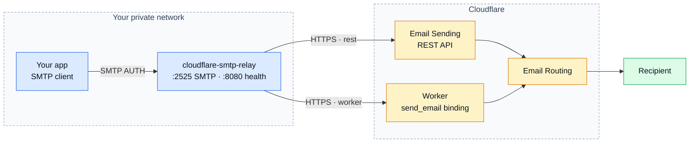
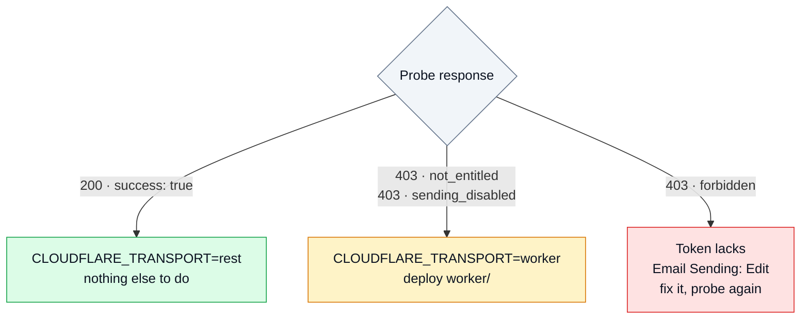

<div align="center">

# cloudflare-smtp-relay

**An SMTP submission server for apps that only speak SMTP, delivering through the Cloudflare Email Service HTTP API.**

[](https://github.com/DanielGS/cloudflare-smtp-relay/actions/workflows/ci.yml)
[](https://github.com/DanielGS/cloudflare-smtp-relay/releases)
[](https://go.dev)
[](#license)
[](https://github.com/DanielGS/cloudflare-smtp-relay/pkgs/container/cloudflare-smtp-relay)
[](#scope)

</div>



> **Send mail from your own domain on Cloudflare's free tier, without paying for Email Sending.**
>
> If you already have **Email Routing** configured, you can send to your verified destination
> addresses at no cost, on any plan. Cloudflare's SMTP endpoint cannot reach that free path —
> only the HTTP surfaces can. This relay puts SMTP back in front of it, so your applications
> keep speaking the protocol they already speak.

One process, no database, no queue. Your application keeps sending SMTP; the Cloudflare token
lives in exactly one place.

---

## Table of Contents

- [Why this exists](#why-this-exists)
- [Quick start](#quick-start)
- [Cloudflare setup](#cloudflare-setup)
- [Connecting an application](#connecting-an-application)
- [Configuration](#configuration)
- [How the relay answers your client](#how-the-relay-answers-your-client)
- [Logging](#logging)
- [Health](#health)
- [Verifying an end-to-end send](#verifying-an-end-to-end-send)
- [Troubleshooting](#troubleshooting)
- [Development](#development)
- [Scope](#scope)
- [Versioning](#versioning)
- [Contributing](#contributing)
- [Security](#security)
- [License](#license)

---

## Why this exists

### Email Routing is free. Email Sending is not.

Cloudflare has two ways to send mail, and the difference decides whether your side project
costs nothing or five dollars a month.

| | Reaches | Costs |
|---|---|---|
| **Email Routing** — REST API or Workers `send_email` binding | Your **verified destination addresses** | Free, on any plan |
| **Email Sending** — arbitrary recipients | Anyone | Workers Paid, from $5/month |

Cloudflare documents the free path plainly:

> You can also send to verified destination addresses directly through the REST API or the
> Workers binding, free of charge on any plan — including when only Email Routing is
> configured.
>
> — [Cloudflare docs, Email Routing addresses](https://developers.cloudflare.com/email-service/configuration/email-routing-addresses/)

### But SMTP cannot reach it

That free path exists **only over HTTP**. Cloudflare's SMTP endpoint
(`smtp.mx.cloudflare.net:465`) has no free tier at all: it requires a domain onboarded to Email
Sending, with no exception for verified destinations. Point an application at it on a free plan
and you get:

```
550 5.7.1 Email sending is not enabled for domain yourdomain.example
```

So applications that only speak SMTP — which is most of them — are locked out of a capability
their account already has.

### What this relay does about it

It accepts SMTP on your private network and forwards over HTTPS, which is the surface that can
use the free path. Your application does not change; it keeps sending SMTP to a host and port.

| Problem | What the relay does |
|---|---|
| Your app only speaks SMTP | Accepts SMTP submission, speaks HTTPS upstream |
| The free path is HTTP-only | Uses the REST API, or a Worker when your account lacks REST entitlement |
| The Cloudflare token would be copied into every app | Keeps it in one process |
| Any app could send as any domain | Enforces a sender-domain allowlist centrally |

### Is this for you?

**Yes, if** you self-host side projects that email *you* — backup reports, cron failures, alerts,
a contact form that lands in your own inbox — from a domain you already run on Cloudflare.
That is exactly what the free tier covers, and this relay is built for it.

**No, if** you need to email arbitrary recipients: customers, newsletter subscribers, users
signing up. Those addresses cannot be verified destinations, so you need Email Sending on the
Workers Paid plan. The relay still works there — set `CLOUDFLARE_TRANSPORT=rest` — but it is
not solving a billing problem for you, just an SMTP one.

---

## Quick start

> **Prerequisite:** the Cloudflare side must be configured first — see
> [Cloudflare setup](#cloudflare-setup). It takes about five minutes and decides one
> environment variable.

```bash
git clone https://github.com/DanielGS/cloudflare-smtp-relay.git
cd cloudflare-smtp-relay
cp .env.example .env
```

Edit `.env` and set at minimum:

```env
SMTP_PASSWORD=<a long random string>
CLOUDFLARE_ACCOUNT_ID=<your account id>
CLOUDFLARE_API_TOKEN=<token with Email Sending: Edit>
ALLOWED_FROM_DOMAINS=subdomain.mydomainexample.com
```

Then:

```bash
docker compose up --build
```

The relay listens on `2525` (SMTP) and `8080` (health) on a Docker network named `mail`.
**Neither port is published to the host by default** — containers reach it by service name.

### Using the prebuilt image

Every push to `main` publishes a multi-arch image (`linux/amd64`, `linux/arm64`) to GitHub
Container Registry, so you do not have to build it yourself:

```bash
docker pull ghcr.io/danielgs/cloudflare-smtp-relay:latest
```

To use it instead of a local build, swap `build: .` for `image:` in `docker-compose.yml`:

```yaml
services:
  cloudflare-smtp-relay:
    image: ghcr.io/danielgs/cloudflare-smtp-relay:latest
```

Tagged releases (`v1.2.3`) also publish `1.2.3` and `1.2`. Pin one of those in production
rather than tracking `latest`.


Confirm it is alive:

```bash
docker compose exec cloudflare-smtp-relay /relay -healthcheck
```

---

## Cloudflare setup

Required regardless of this relay. Four steps, in order.

### 1. Enable Email Routing on the exact sending domain

A subdomain does **not** inherit Email Routing from the apex domain. To send from
`subdomain.mydomainexample.com`, add it explicitly:

> Dashboard → **Email Routing** on `mydomainexample.com` → **Settings** → **Subdomains** →
> add `subdomain.mydomainexample.com`

Cloudflare adds the required DNS records. Skipping this is the most common cause of
`Email sending is not enabled for domain …`.

### 2. Verify your destination addresses

> Dashboard → **Email Routing** → **Destination addresses**

On the free tier you can only send **to** addresses verified here. Arbitrary recipients
require the Workers Paid plan.

### 3. Create an API token

An API token with the **Email Sending: Edit** permission.

### 4. Probe which transport your account can use

This single request decides whether you need the Worker.

```bash
curl -i "https://api.cloudflare.com/client/v4/accounts/$CF_ACCOUNT_ID/email/sending/send" \
  -H "Authorization: Bearer $CF_API_TOKEN" \
  -H "Content-Type: application/json" \
  -d '{
    "from": "no-reply@subdomain.mydomainexample.com",
    "to": "your-verified-destination@example.com",
    "subject": "relay probe",
    "text": "probe"
  }'
```



<details>
<summary><b>Worker transport — when the probe says you need it</b></summary>

The Email Routing `send_email` binding works on any plan, unlike the REST surface. The Worker
in [`worker/`](worker/) exposes that binding over HTTP so the relay, running outside
Cloudflare, can reach it.

```bash
cd worker
npx wrangler deploy
npx wrangler secret put RELAY_SECRET   # openssl rand -hex 32
```

```env
CLOUDFLARE_TRANSPORT=worker
WORKER_URL=https://smtp-relay-sender.<your-subdomain>.workers.dev
WORKER_SECRET=<the same random string>
```

`CLOUDFLARE_ACCOUNT_ID` and `CLOUDFLARE_API_TOKEN` are unused in this mode. Full contract and
security notes: [`worker/README.md`](worker/README.md).

</details>

---

## Connecting an application

Put your app on the same network:

```yaml
services:
  my-app:
    image: my-app:latest
    networks:
      - mail

networks:
  mail:
    external: true
```

Point it at the relay:

```env
SMTP_HOST=cloudflare-smtp-relay
SMTP_PORT=2525
SMTP_USER=relay
SMTP_PASSWORD=change-me
EMAIL_FROM=no-reply@subdomain.mydomainexample.com
```

No TLS is needed on this hop: the traffic never leaves the Docker network. The relay still
requires SMTP AUTH, so an unauthenticated container cannot use it as an open relay.

---

## Configuration

Every setting comes from an environment variable. Nothing is baked into the image.

### SMTP listener

| Variable | Default | Notes |
|---|---|---|
| `SMTP_HOST` | `0.0.0.0` | |
| `SMTP_PORT` | `2525` | |
| `SMTP_USER` | *(required)* | Credentials your applications authenticate with. |
| `SMTP_PASSWORD` | *(required)* | Not Cloudflare's token. Change it. |
| `SMTP_MAX_MESSAGE_BYTES` | `5242880` | 5 MiB. Cannot be raised above Cloudflare's cap. |
| `SMTP_MAX_RECIPIENTS` | `50` | Cannot be raised above Cloudflare's cap. |
| `SMTP_READ_TIMEOUT` | `30s` | |
| `SMTP_WRITE_TIMEOUT` | `30s` | |
| `SMTP_TLS_CERT` / `SMTP_TLS_KEY` | empty | Optional. Set both to serve SMTP over TLS. |

### Cloudflare transport

| Variable | Default | Notes |
|---|---|---|
| `CLOUDFLARE_TRANSPORT` | `rest` | `rest` or `worker`. See [the probe](#4-probe-which-transport-your-account-can-use). |
| `CLOUDFLARE_ACCOUNT_ID` | *(required for `rest`)* | |
| `CLOUDFLARE_API_TOKEN` | *(required for `rest`)* | Never logged. |
| `CLOUDFLARE_API_BASE_URL` | `https://api.cloudflare.com/client/v4` | Override for testing. |
| `CLOUDFLARE_TIMEOUT` | `15s` | Per attempt. |
| `CLOUDFLARE_MAX_RETRIES` | `2` | Temporary failures only. |
| `WORKER_URL` | *(required for `worker`)* | Your Worker's URL. |
| `WORKER_SECRET` | *(required for `worker`)* | Shared secret. Never logged. |

### Policy, health and logging

| Variable | Default | Notes |
|---|---|---|
| `ALLOWED_FROM_DOMAINS` | empty | Comma-separated; spaces, case and duplicates are normalized away. Empty means any sender. Matching is **exact**, with no wildcards and no subdomain inheritance: `mydomainexample.com` does not permit `notifications.mydomainexample.com`. List every domain. |
| `HEALTH_HOST` / `HEALTH_PORT` | `0.0.0.0` / `8080` | |
| `LOG_LEVEL` | `info` | `debug`, `info`, `warn`, `error`. |

---

## How the relay answers your client

The relay does not collapse every failure into `550`. It separates what is worth retrying from
what is not, so a transient Cloudflare problem never makes a client discard a valid message.

| Situation | SMTP reply |
|---|---|
| ✅ Cloudflare accepted the message | `250 2.0.0` |
| ⏳ Rate limited (`429`) | `451 4.4.5`, honoring `Retry-After` |
| ⏳ Cloudflare server error (`500`, `503`) | `451 4.3.0` |
| ⏳ Timeout, DNS or network failure, unreadable response | `451 4.4.1` |
| ⏳ Authentication or entitlement failure (`401`, `403`) | `451 4.7.0` — see below |
| ❌ Malformed message rejected by Cloudflare (`400`) | `550 5.6.0` |
| ❌ Account or resource not found (`404`) | `550 5.1.2` |
| ❌ Sender outside `ALLOWED_FROM_DOMAINS` | `550 5.7.1`, refused at `MAIL FROM` |
| ❌ Message above the size limit | `552 5.3.4` |
| ❌ Bad SMTP credentials | `535 5.7.8` |

> **Why `401`/`403` are temporary.** A bad or unentitled token is a fault in the relay's
> configuration, not in the message. Answering `550` would make the client throw away a
> perfectly valid email. Answering `451` makes it retry, so the message goes out on its own
> once the token is fixed. Retries are attempted only for genuinely temporary conditions,
> never for a permanent rejection.

---

## Logging

One structured JSON record per message, at `info` — or `warn`/`error` when deferred or
rejected:

```json
{
  "time": "2026-09-22T07:41:12.913Z",
  "level": "INFO",
  "msg": "delivery",
  "message_id": "0b0f8f2c-9a6c-4f5c-8f5a-1d2e3f4a5b6c",
  "rfc_message_id": "20260922074112.1@app.internal",
  "from": "no-reply@subdomain.mydomainexample.com",
  "to": ["ops@example.com"],
  "subject": "Nightly report",
  "result": "sent",
  "duration_ms": 412,
  "http_status": 200,
  "attempts": 1
}
```

**Never logged:** the message body, the Cloudflare API token, the SMTP password, the Worker
secret. Subjects are truncated to 120 characters.

---

## Health

```bash
curl -s localhost:8080/health
{"status":"ok"}
```

The endpoint reports process liveness only and exposes no configuration. The container image
has no shell and no `curl`, so the Docker `HEALTHCHECK` invokes the binary's own probe mode:

```bash
docker compose exec cloudflare-smtp-relay /relay -healthcheck
```

---

## Verifying an end-to-end send

From a container on the `mail` network, using `swaks`:

```bash
docker run --rm --network mail instrumentisto/swaks \
  --server cloudflare-smtp-relay:2525 \
  --auth PLAIN --auth-user relay --auth-password change-me \
  --from no-reply@subdomain.mydomainexample.com \
  --to your-verified-destination@example.com \
  --header "Subject: relay test" \
  --body "hello from the relay"
```

Expect `250` and one log line with `"result":"sent"`.

Worth checking the rejection paths too:

- [ ] Wrong password → `535`
- [ ] Sender on another domain → `550`
- [ ] Attachment over 5 MiB → `552`

---

## Troubleshooting

<details>
<summary><code>550 5.7.1 Email sending is not enabled for domain …</code></summary>

Cloudflare is rejecting the **sender domain**. Confirm the exact domain or subdomain is added
under Email Routing → Settings → Subdomains, and that
[the probe](#4-probe-which-transport-your-account-can-use) succeeds.

</details>

<details>
<summary><code>403</code> with <code>10105 not_entitled</code> from the probe</summary>

Your account cannot use the Email Sending REST surface. Switch to
`CLOUDFLARE_TRANSPORT=worker`, or buy the Workers Paid plan.

</details>

<details>
<summary>Mail accepted by the relay but never delivered</summary>

On the free tier the recipient must be a verified destination address. Check Email Routing →
Destination addresses.

</details>

<details>
<summary>Client reports <code>451</code> repeatedly</summary>

Read the logs: `http_status` and `cf_error_code` name the upstream cause. A `401`/`403` there
means the token is wrong or lacks `Email Sending: Edit`.

</details>

---

## Development

```bash
make help     # list targets
make test     # go test -race -count=1 ./...
make lint     # go vet, plus golangci-lint when installed
make build    # static binary into ./bin
make run      # run locally, sourcing .env
make up       # docker compose up --build
```

Requires Go 1.27+. Tests use doubles throughout; the Cloudflare API is simulated with
`httptest`. **No test makes a live call.**

```
cmd/relay          entrypoint and wiring
internal/smtpserver  SMTP submission server, AUTH, session handling
internal/email       parsing, policy, message model
internal/cloudflare  REST and Worker transports, error classification
internal/config      environment parsing, validation, redaction
internal/logging     structured delivery records
internal/health      liveness endpoint and probe mode
worker/              optional Cloudflare Worker transport
scripts/             release tooling, not part of the build
```

### Releasing

Releases are cut by running the **Release** workflow, either from the Actions tab or with:

```bash
gh workflow run release.yml -f version=1.1.0
```

Pass the version **without** a leading `v` (`1.1.0`, not `v1.1.0`). The workflow requires
write access to the repository, so only maintainers can run it. It moves the CHANGELOG's
`[Unreleased]` entries into a new dated version section, tags the release, publishes the
GitHub release, and triggers the container image build for that tag.

---

## Scope

**Included:** SMTP submission, AUTH, sender allowlist, size and recipient limits, two
Cloudflare transports, bounded retries for temporary failures, structured logs, liveness.

**Not included, by design:** mail reception, IMAP/POP3, a persistent queue, unbounded retries,
a web panel, a database.

---

## Versioning

This project follows [Semantic Versioning](https://semver.org/). The public interface that
semver applies to is:

- **Environment variables** — the configuration surface documented in
  [Configuration](#configuration).
- **SMTP reply-code behavior** — the mapping documented in
  [How the relay answers your client](#how-the-relay-answers-your-client).
- **Published image tags** — the tags described below.

Go packages under `internal/` are **not** part of that interface: Go's own visibility rules
make them importable by nobody outside this module, so their signatures can change freely
between releases without a version bump.

Each tagged release publishes three image tags to GHCR:

| Tag | Meaning |
|---|---|
| `1.2.3` | Immutable. Never repointed once published. |
| `1.2` | Moving pointer to the latest `1.2.x` patch. |
| `latest` | Moving pointer to the most recent build of the default branch, not a release. |

Pin an exact version (`1.2.3`) in production rather than `1.2` or `latest`, so an upgrade is a
deliberate action instead of something that happens on the next `docker pull`.

The running binary reports its own version with `relay -version`, and the `relay starting` log
line carries a `version` field.

---

## Contributing

Issues and pull requests are welcome. Before opening a PR:

- [ ] `make test` passes
- [ ] `make lint` passes
- [ ] New behavior has a test that fails without the change
- [ ] Commit messages follow [Conventional Commits](https://www.conventionalcommits.org/)

For questions or ideas, open an issue rather than a PR.

---

## Security

Do not report security issues in a public issue. Email the maintainer instead.

The relay is designed to hold secrets and refuse to leak them: tokens and passwords are
redacted from configuration dumps, never written to logs, and the Worker compares its shared
secret in constant time. Run it on a private network; it has no TLS requirement because it is
not meant to be exposed to the internet.

---

## License

[MIT](LICENSE) © DanielGS
