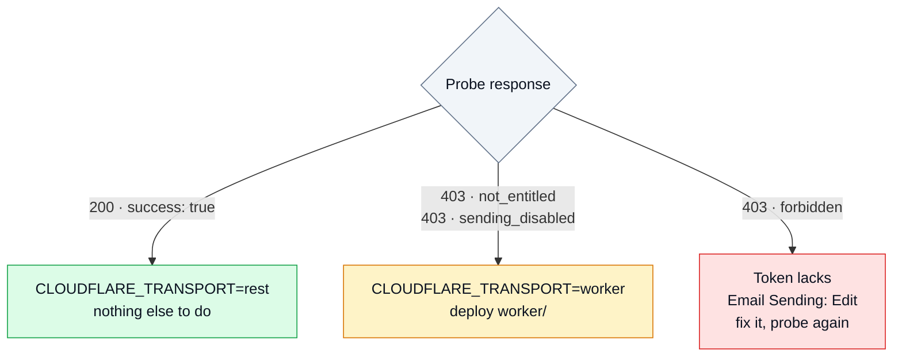

# Cloudflare setup

Required regardless of this relay. Four steps, in order.

### 1. Enable Email Routing on the exact sending domain

A subdomain does **not** inherit Email Routing from the apex domain. To send from
`subdomain.mydomainexample.com`, add it explicitly:

> Dashboard → **Email Routing** on `mydomainexample.com` → **Settings** → **Subdomains** →
> add `subdomain.mydomainexample.com`

Cloudflare adds the required DNS records. Skipping this is the most common cause of
`Email sending is not enabled for domain …`.

### 2. Verify your destination addresses

> Dashboard → **Email Routing** → **Destination addresses**

On the free tier you can only send **to** addresses verified here. Arbitrary recipients
require the Workers Paid plan.

### 3. Create an API token

An API token with the **Email Sending: Edit** permission.

### 4. Probe which transport your account can use

This single request decides whether you need the Worker.

```bash
curl -i "https://api.cloudflare.com/client/v4/accounts/$CF_ACCOUNT_ID/email/sending/send" \
  -H "Authorization: Bearer $CF_API_TOKEN" \
  -H "Content-Type: application/json" \
  -d '{
    "from": "no-reply@subdomain.mydomainexample.com",
    "to": "your-verified-destination@example.com",
    "subject": "relay probe",
    "text": "probe"
  }'
```



<details>
<summary><b>Worker transport — when the probe says you need it</b></summary>

The Email Routing `send_email` binding works on any plan, unlike the REST surface. The Worker
in [`worker/`](../worker/) exposes that binding over HTTP so the relay, running outside
Cloudflare, can reach it.

```bash
cd worker
npx wrangler deploy
npx wrangler secret put RELAY_SECRET   # openssl rand -hex 32
```

```env
CLOUDFLARE_TRANSPORT=worker
WORKER_URL=https://smtp-relay-sender.<your-subdomain>.workers.dev
WORKER_SECRET=<the same random string>
```

`CLOUDFLARE_ACCOUNT_ID` and `CLOUDFLARE_API_TOKEN` are unused in this mode. Full contract and
security notes: [`worker/README.md`](../worker/README.md).

</details>
